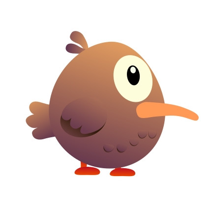

# Flapless

*A flightless bird, a canyon full of dangers, and just enough balloons to make bad decisions.*

**Flapless** is a chaotic arcade roguelike where you play as a determined, balloon-powered bird navigating a deadly vertical canyon. Inspired by NES classics like *Balloon Fight*, but with modern progression and physics-based madness.

---

## Features

- Balloon-based platforming — Momentum, bounce, and burst management
- Vertically-scrolling levels — Procedurally assembled from handcrafted chunks
- Shops & upgrades — Mid-run boosts, reset between runs
- Trait selection — Pick from 3 perks at the end of each level
- Underdog story — A flightless bird with big dreams
- Endless mode — Unlock after beating the game

---

## Themes

- Overcoming obstacles  
- Self-acceptance  
- Flight is optional. Style isn’t.

---

## Development Status

**Current phase:** Core mechanics, movement, and level generation prototyping.  
UI, art, and audio are placeholder. Focus is on getting it fun first.

---

## Tech Stack

- Unity (C#)  
- Spelunky-style level generation  
- Minimalist 2D vector art (for now)

---

## Planned Platforms

- Mobile (initial target)
- PC (possibly)  

---

## Team

Just a solodev trying to finish something cool and small.  

---

## Screenshots / GIFs

 

---

## Contact

Questions? Suggestions? Fan mail for the bird?  
Open an issue or reach out via [lukas.isaksson@pm.me].

---
